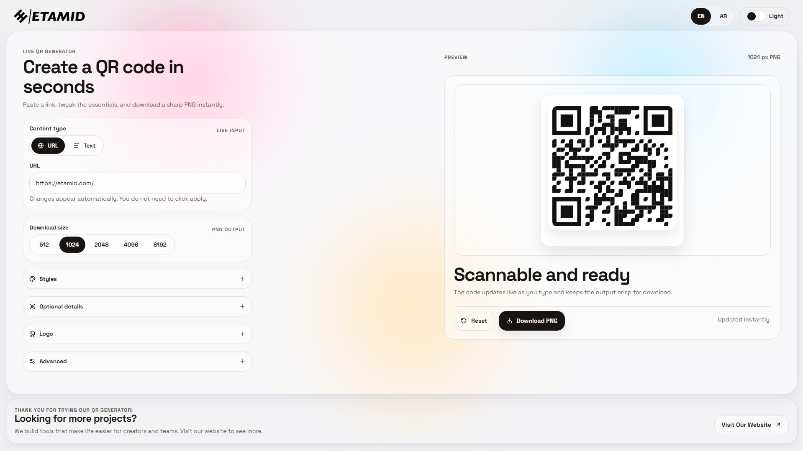

# QR Generator

A polished static QR code generator with live preview, bilingual English and Arabic support, theme switching, style presets, logo embedding, high-resolution PNG export, SEO metadata, and installable PWA support.



## Overview

This project is a lightweight front-end app built with plain HTML, CSS, and JavaScript. It is designed for fast editing and easy deployment with no build step.

The generator updates instantly as the user types, keeps advanced options tucked away until needed, and supports both desktop and mobile layouts.

The project now ships with separate crawlable English and Arabic entry pages for stronger multilingual SEO, along with sitemap, robots, manifest, and service worker files for deployment.

## Features

- Live QR code preview with no apply button
- URL and plain text modes
- English and Arabic interface with RTL support
- Dedicated English and Arabic routes for SEO: `/` and `/ar/`
- Light and dark theme toggle
- Download PNG sizes from `512` up to `8192`
- Style presets: `Card`, `Studio`, `Stamp`, `Ink`, and `Transparent`
- QR dot and eye customization powered by `qr-code-styling`
- Optional label and description under the QR code
- Optional centered logo with size and badge controls
- Solid foreground and background color controls
- Reset action for returning to the default state
- Open Graph, Twitter, canonical, and `hreflang` metadata
- `robots.txt` and `sitemap.xml`
- Installable PWA manifest and offline caching via service worker

## Stack

- `index.html` for the app structure
- `ar/index.html` for the Arabic entry page
- `assets/styles.css` for the tokenized design system and responsive layout
- `assets/main.js` for translations, UI state, preview rendering, and export logic
- `assets/qr-code-styling.js` for QR rendering and image export
- `manifest.webmanifest` for installable app metadata
- `service-worker.js` for offline asset caching
- `robots.txt` and `sitemap.xml` for search engine discovery
- `lucide` from CDN for icons
- Google Fonts for `Space Grotesk` and `Cairo`

## Run Locally

There is no build process or package installation required for the app itself.

Open the project directly in a browser, or serve it locally with a simple static server:

```bash
python -m http.server 8000
```

Or with `http-server`:

```bash
npx http-server .
```

Then open `http://localhost:8000` in your browser.

## Usage

1. Choose `URL` or `Text`.
2. Enter the content to encode.
3. Pick an export size.
4. Optionally adjust styles, colors, label, description, logo, and error correction.
5. Download the final PNG.

## Project Structure

```text
.
|-- index.html
|-- ar/
|   `-- index.html
|-- README.md
|-- LICENSE
|-- manifest.webmanifest
|-- service-worker.js
|-- robots.txt
|-- sitemap.xml
`-- assets/
	|-- main.js
	|-- styles.css
	|-- qr-code-styling.js
	`-- images/
```

## Notes

- The app is fully static and suitable for simple hosting environments.
- Fonts, icons, and some assets are loaded from external CDNs.
- The QR rendering and export path are aligned so preview and downloaded output stay visually consistent.
- The production metadata in this repo is configured for `https://qr.etamid.com/`.
